<div align="center">

# Canary

**Most finance tools tell you what happened. Canary watches for when financial behavior changes.**

Canary reconciles a startup's bank ledger, detects sustained shifts in spending with change-point detection, researches the vendors it doesn't recognize, and texts the founder one explainable incident — with a voice note, a deep link, and a what-if simulator. Every number is computed by deterministic code. No language model ever does the arithmetic.

### Live app

| | |
| --- | --- |
| **Live app** | **[https://canary.bill-nguyentonhoang.workers.dev](https://canary.bill-nguyentonhoang.workers.dev)** |
| **Primary incident** | [`/incidents/inc_5b393334`](https://canary.bill-nguyentonhoang.workers.dev/incidents/inc_5b393334) |
| **Health** | [`/api/health`](https://canary.bill-nguyentonhoang.workers.dev/api/health) |

[](https://canary.bill-nguyentonhoang.workers.dev)

LOCK IN Hack 2026 at Rho · Primary sponsor integration: Tavily · Secondary: ElevenLabs

[](https://developers.cloudflare.com/workers/)
[](https://hono.dev)
[](https://www.typescriptlang.org)
[](https://react.dev)
[](https://vite.dev)

[](https://tavily.com)
[](https://elevenlabs.io)
[](https://openai.com)
[](https://sendblue.co)

</div>

---

## The problem

A seed-stage founder has meaningful cash, a dozen recurring vendors, employee card spend, and no CFO. The tools they have are dashboards: they render last month accurately and wait to be asked. The founder finds out that cloud spend has been climbing for six weeks when they happen to open the chart.

The thing worth knowing is not the level of spend. It is the moment the *behavior* changed — a rate that used to hold steady and no longer does. That is a change-point problem, not a reporting problem, and nobody watching a bar chart solves it reliably.

Canary is the watcher. It reconciles the ledger first so the series it monitors is real, runs a one-sided CUSUM on weekly variable spend, decomposes the shift into vendors, corroborates the vendors it cannot classify from rules alone, and then interrupts the founder exactly once — over iMessage, where they already read things.

Per hackathon guidance this build runs on a **fictional company** (Perch Analytics, Inc., seed-stage B2B analytics, 14 people) banking with a **fictional Canary Sandbox Bank**. The live Rho API is not used. The sandbox sits behind a `BankProvider` interface, and the synthetic history is generated *backward* from the sandbox's reported closing balance so the ledger closes on that anchor to the cent. The only real external data is the Tavily vendor research, which resolves a real indexed vendor.

---

## See it live

**App:** [https://canary.bill-nguyentonhoang.workers.dev](https://canary.bill-nguyentonhoang.workers.dev)

| Dashboard | Incident — overview |
| --- | --- |
| 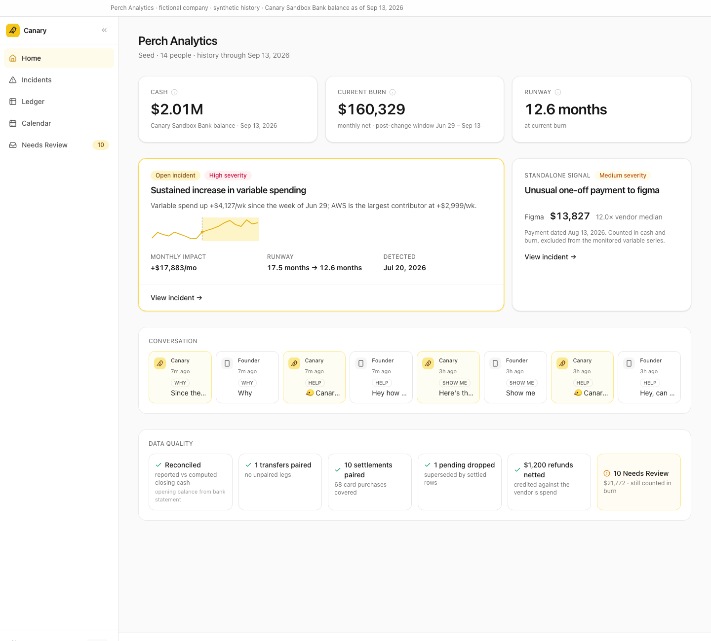 | 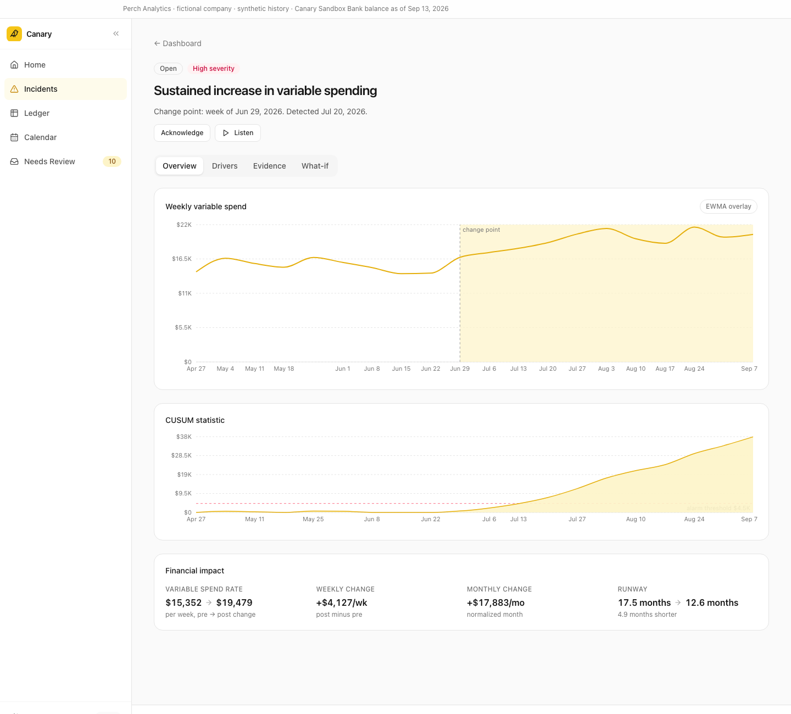 |
| Cash, current burn, runway, the open incident with its sparkline, the standalone one-off signal, the iMessage conversation strip, and the reconciliation data-quality strip. | Weekly variable spend with the change point marked, the CUSUM statistic against its threshold, and the financial impact of the shift. |

| Incident — evidence | Incident — what-if |
| --- | --- |
| 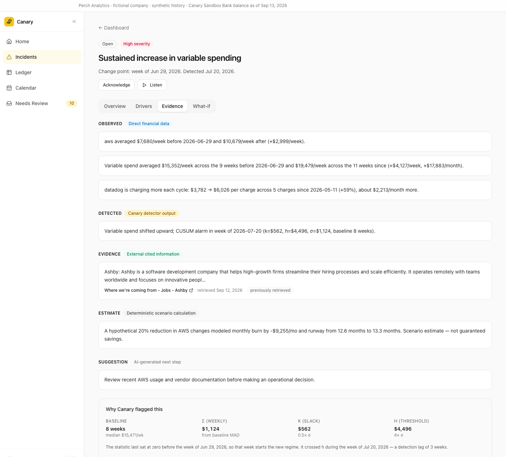 | 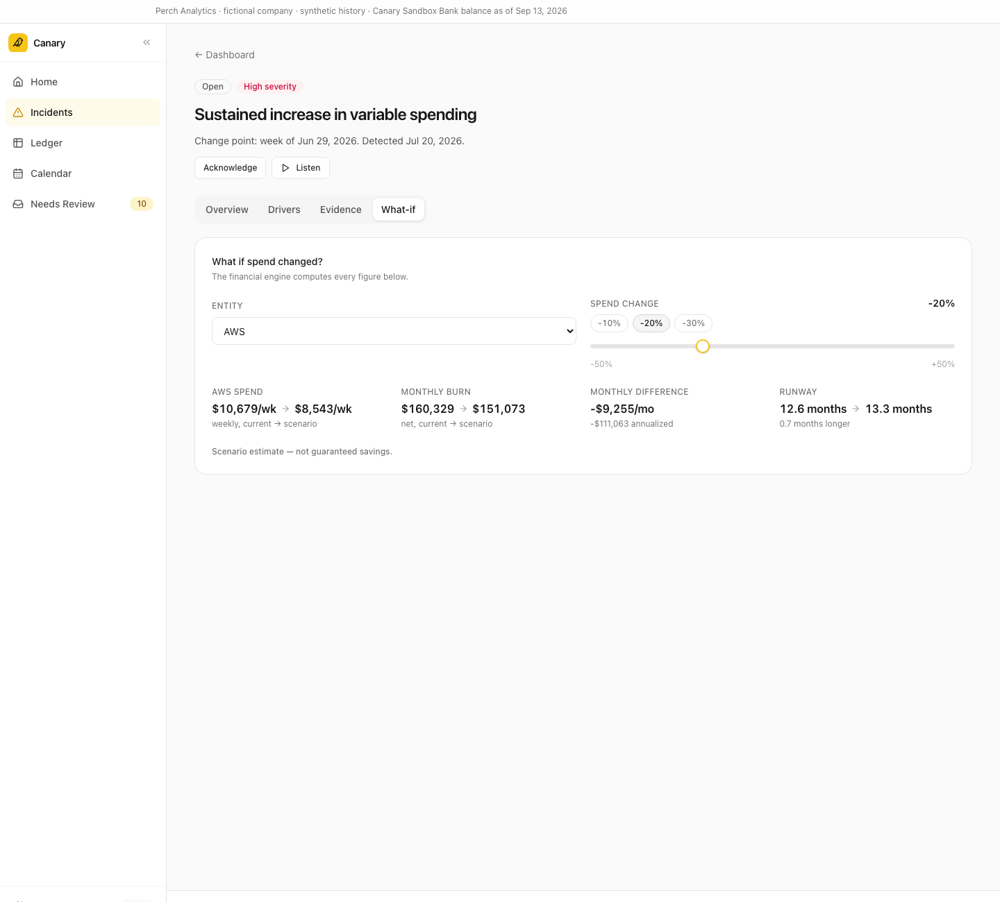 |
| OBSERVED → DETECTED → EVIDENCE → ESTIMATE → SUGGESTION, in that order, with the Tavily citation and the CUSUM parameters that fired. | Pick an entity and a percentage; the engine returns spend, burn, monthly difference and runway. Labeled a scenario estimate. |

| Phone — dashboard | Phone — incident |
| --- | --- |
| 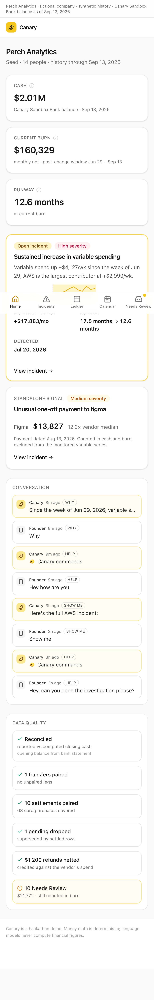 | 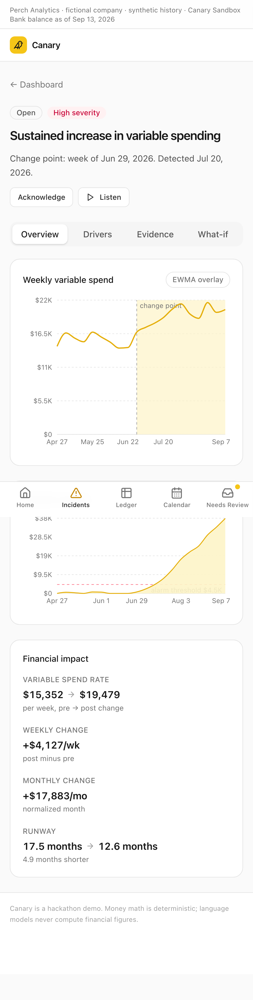 |

---

## What it does

- **Reconciles before it detects.** Pending rows superseded by their settled twin are dropped, internal transfers net to zero, card settlements are paired to the purchases they cover so nothing is counted twice, vendor refunds net against that vendor's spend, and financing sits outside operating burn. The computed closing balance must equal the bank's reported closing balance exactly, in integer cents.
- **Detects a sustained shift, not a big week.** A one-sided upward CUSUM on weekly variable spend, with σ from a robust MAD estimate over the baseline window. Tagged one-off payments are winsorized out of the monitored series first — they still count in cash and burn.
- **Decomposes the shift into vendors.** Pre/post weekly rates per entity, so the alert can name the largest contributor instead of saying "spending is up".
- **Researches what it can't classify.** Deterministic merchant rules first; OpenAI proposes a category for the long tail; Tavily independently identifies what the company does and returns a cited, dated source. Corroborated only when the two agree — otherwise **Needs Review**, and the amount still counts in burn.
- **Groups related signals into one incident.** Burn drift, cloud acceleration and a drifting SaaS renewal that are the same underlying problem produce one alert, not three. Re-detection updates the incident instead of duplicating it.
- **Interrupts once, and only when it should.** Material, OPEN, not already notified — and not while the founder is in a meeting, in which case the alert is queued and delivered by cron when they're free.
- **Answers follow-ups.** `WHY` / `SHOW ME` / `SOURCES` / `HELP` over iMessage, a deep link into the incident page, and a deterministic what-if simulator on web and as an agent tool.

---

## The alert

Two messages, one incident object. The text carries the exact figures; the ElevenLabs voice note is the same incident spoken, with rounded figures and no URLs. They render from `renderAlert` in [`apps/api/src/messages.ts`](apps/api/src/messages.ts), so they cannot disagree.

**Text** (`alertMessage`, rate-shift incident):

```text
🐤 Canary
I detected a sustained increase in variable spending.
[PRIMARY DRIVER] is currently the largest contributor.
Impact: modeled runway [BEFORE] → [AFTER] versus the previous spending regime.
Reply WHY or SHOW ME.
```

**Text** (`alertMessage`, one-off incident):

```text
🐤 Canary
I flagged an unusual one-off payment to [VENDOR].
Amount: [AMOUNT], well above this vendor's usual payments.
Reply WHY or SHOW ME.
```

**Voice note** (`alertVoiceScript`, ~10–20 seconds): *"Hi, it's Canary. Your spending pattern shifted upward [ABOUT N WEEKS AGO], and [PRIMARY DRIVER] is the largest contributor. At the new rate, modeled runway is [AFTER], down from [BEFORE]. Reply why for the breakdown, or show me to open the full investigation."*

Every bracketed value is substituted from the incident object and formatted by `@canary/shared` helpers — `formatUsd*`, `formatMonths` for text, `speakUsd` / `speakMonths` for speech. No figure in either message is written by a model.

Delivery is real iMessage, not SMS: ElevenLabs `pcm_24000` → loudness normalization → a CAF container written in-Worker ([`apps/api/src/voice/caf.ts`](apps/api/src/voice/caf.ts)) → uploaded to Sendblue's CDN and sent as `media_url`, which renders as a native voice memo. No R2, no ffmpeg. There is no screenshot of the thread in this repo — the templates above are the alert.

---

## How it works

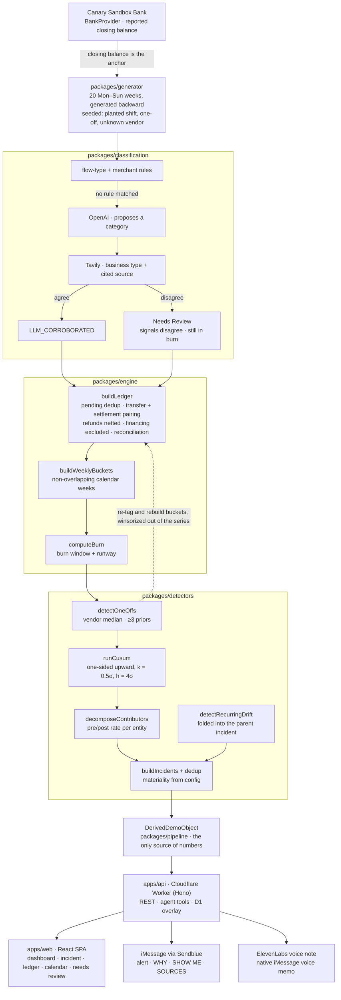

The one-off detector runs before CUSUM and feeds its results *back* into `buildLedger`, which moves those amounts from `variable_spend_cents` into `excluded_from_monitoring_cents`. That is why a single large vendor payment cannot masquerade as a regime change while still showing up in cash and burn.

---

## Incident and notification lifecycle

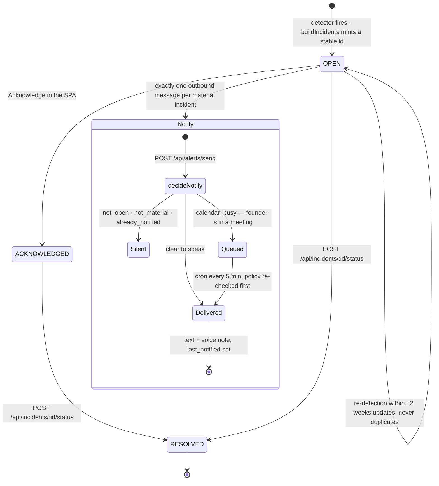

Status changes persist in D1 and are applied as an overlay over whichever `DataProvider` is injected, so an acknowledgement survives a redeploy. Deferred alerts live in the `pending_alerts` table and are drained by the Worker's `*/5 * * * *` cron trigger, which re-checks the policy before delivering and pushes the alert out again if the meeting is still running — so an open-ended calendar block cannot silently swallow it. `POST /api/alerts/deliver-pending` runs the same job on demand. `{ "force": true }` bypasses the whole policy for the demo. The decision logic is a pure function in [`apps/api/src/alerts/policy.ts`](apps/api/src/alerts/policy.ts) — no I/O, no model, no thresholds of its own.

---

## Financial correctness

Reconciliation runs before any detector, because a series built on double-counted card settlements is not worth monitoring.

| Shape in the statement | What `buildLedger` does |
| --- | --- |
| Pending row later superseded by a settled row | Drops the pending row; only the settled amount counts |
| Internal transfer between own accounts | Pairs both legs; net spend is exactly $0 |
| Card purchases plus the card settlement that pays them | Pairs settlement to the purchases it covers; the purchase counts, the settlement does not |
| Vendor refund | Inherits the vendor's category and nets against that vendor's spend |
| Financing (SAFE, loan, credit line) | Excluded from operating burn, still moves cash |
| Annual renewal / one-off | Stays in cash and burn, excluded from the monitored variable series |
| Uncorroborated transaction | **Needs Review** — surfaced in the UI, and the outflow still counts in burn |
| Reconciliation itself | `opening + Σ cash flows` must equal the bank's reported closing balance; discrepancy is reported, not hidden |

`npm run verify` runs the whole pipeline and asserts contract §15. It must print `ALL CHECKS PASSED`:

```text
closing balance matches sandbox bank balance exactly     one-off winsorized out of CUSUM series
internal transfer net spend = 0                          CUSUM fires before final week
card settlement not double counted                       estimated change point within tolerance
pending superseded rows dropped                          CUSUM does not fire on pre-change weeks alone
financing excluded from operating burn                   post-change burn window is representative
Needs Review outflow included in burn                    contributor deltas sum to total delta
one-off has ≥3 prior vendor payments                     primary driver is the planted driver
one-off detector fires on planted payment                incident dedup prevents duplicates
dedup survives primary-driver drift                      stale stored incident never becomes primary
recurring drift folds into the burn incident             Tavily vendor result is cached and cited
unknown vendor corroborated (OpenAI == Tavily)           all dashboard figures derived
```

**Derived demo numbers (from `npm run verify`)** — the only financial figures in this README, quoted verbatim from that command's output:

```text
=== Derived demo numbers ===
cash                 $2,012,880.19
monthly net burn     $163,481.89  (window 2026-06-29..2026-09-13, POST_CHANGE_SEGMENT)
runway               12.3 months
cusum σ=$1,125.58 k=$562.79 h=$4,502.34 alarm=2026-07-20 change=2026-06-29 lag=3w
variable spend pre→post  $15,403.41 → $19,374.12 /wk (+$3,971/wk)
  aws            +$3,144/wk  +$13,622/mo
  datadog        +$624/wk  +$2,702/mo
  ashby          +$375/wk  +$1,625/mo
  miguel_santos  +$115/wk  +$500/mo
  dell           +$74/wk  +$320/mo
one-off              figma $14,055.00 = 12.0× median $1,171.09
weekly variable      14428 16620 15765 15177 16749 15944 15116 14140 14231 16757 15931 15006 14323 15692 15254 13736 14215 16800 15189 15645 16635 15928 14198 15183 16801 15658 14973 14294 15718 15005 14290 16510 14305 16535 15209 15842 16741 15981 15164 14112 15740 16678 16667 17645 20785 19755 18905 21349 21549 19205 19916 20661
incidents            inc_5b393334:BURN_RATE_SHIFT:aws:HIGH, inc_40e99e9c:ONE_OFF_VENDOR_PAYMENT:figma:MEDIUM
```

`npm test` runs **1,202 tests** (2 skipped: live-provider tests that need real API keys), entirely offline. The ledger is a full year — 52 weeks, 626 transactions — plus a 26-week generated horizon that the demo clock reveals one day per real minute, with reconciliation exact to the cent at every instant.

---

## Detection

Every threshold lives in [`packages/shared/src/config.ts`](packages/shared/src/config.ts). No package hard-codes one, and no model decides one.

**Change-point detection** — one-sided upward CUSUM on non-overlapping calendar-week variable spend, with tagged one-offs winsorized out and fixed categories (`PAYROLL`, `RENT`, `INSURANCE`) excluded from the series but kept in burn.

| Constant | Value | Meaning |
| --- | --- | --- |
| `CUSUM_DEFAULTS.k_factor` | `0.5` | Slack, as a multiple of σ — the drift the chart tolerates for free |
| `CUSUM_DEFAULTS.h_multiplier` | `4` | Alarm threshold, as a multiple of σ |
| `CUSUM_DEFAULTS.min_baseline_weeks` | `8` | Baseline used for the robust MAD σ estimate |
| `CUSUM_DEFAULTS.sigma_floor_fraction` | `0.02` | Floor on σ, so an unnaturally quiet baseline can't make everything an alarm |
| `TRAILING_WINDOW_WEEKS` | `8` | Burn window before a confirmed regime change |
| `MIN_POST_CHANGE_WEEKS` | `4` | Post-change weeks required before that segment becomes the burn window |
| `CHANGE_POINT_TOLERANCE_WEEKS` | `2` | Assertion tolerance, estimated vs. planted change point |

The estimated change point is the last week before the alarm at which the cumulative statistic sat at zero. Because the burn window follows the confirmed change point, current burn is deliberately *not* "the last 8 weeks" — the window and the reason for it are carried in `burn_window_reason` and named wherever burn is quoted.

**One-off vendor payments** — vendor-relative, so a large payment to a vendor that is always large is not an anomaly.

| Constant | Value | Meaning |
| --- | --- | --- |
| `MIN_PRIOR_VENDOR_PAYMENTS` | `3` | Fewer priors than this and the rule does not run at all |
| `ONE_OFF_MEDIAN_MULTIPLE` | `3` | Payment must be at least this multiple of the vendor's median |
| `ONE_OFF_MIN_ABS_DIFF_CENTS` | `200_000` | …and at least this many cents above it, so small vendors don't trip it |

**Materiality** — whether Canary is allowed to interrupt at all. Deterministic, and evaluated by the detectors, never by a model.

| Constant | Value | Meaning |
| --- | --- | --- |
| `MATERIALITY.MIN_MONTHLY_DELTA_CENTS` | `500_000` | Monthlyized rate delta at or above this is material… |
| `MATERIALITY.MIN_BURN_PERCENT` | `0.05` | …or a delta of at least this share of normalized monthly gross burn… |
| `MATERIALITY.MIN_RUNWAY_IMPACT_MONTHS` | `0.5` | …or a runway impact of at least this many months |
| `MATERIALITY.MIN_ONE_OFF_AMOUNT_CENTS` | `500_000` | One-off amount at or above this is material… |
| `MATERIALITY.MIN_ONE_OFF_BURN_PERCENT` | `0.03` | …or at least this share of normalized monthly gross burn |
| `SEVERITY_THRESHOLDS.HIGH_RUNWAY_IMPACT_MONTHS` | `1.5` | Runway impact at or above this is HIGH severity (`MEDIUM_…` is `0.5`) |
| `INCIDENT_DEDUP_WEEKS` | `2` | Same type + entity within this many weeks updates the incident |
| `CONTRIBUTOR_SUM_TOLERANCE` | `0.02` | Contributor deltas must sum to the total delta within this fraction |

---

## The evidence taxonomy

Every explanation Canary produces — iMessage, incident page, voice — is built from five kinds of statement, always in this order. A founder reaches a suggestion only after seeing the data, the rule, the source, and the arithmetic. `EVIDENCE_KINDS` in `@canary/shared` is the canonical order and [`apps/api/src/evidence.ts`](apps/api/src/evidence.ts) enforces it.

| Kind | Means | Where the words may come from |
| --- | --- | --- |
| **OBSERVED** | What the money did | `DerivedDemoObject` only — ledger, weekly buckets, burn, contributors |
| **DETECTED** | What a detector concluded, and with which parameters | `detection.cusum` / `detection.one_off`, plus the config constants the rule used |
| **EVIDENCE** | External, cited, dated | A Tavily `VendorEnrichment`. Never a model's recollection |
| **ESTIMATE** | Deterministic arithmetic on a hypothetical | `simulateCostChange` output, always carrying `SCENARIO_LABEL` |
| **SUGGESTION** | A next step for a human | Generic and non-operational — never "cancel AWS" |

A kind with no content is omitted silently; a kind is never skipped to shorten a sentence, and never reordered. The full speech contract is [`docs/AGENT_BEHAVIOR.md`](docs/AGENT_BEHAVIOR.md), including what Canary must refuse: numbers it wasn't given, URLs it didn't receive from `buildAppPath`, operational orders, causal claims about the business, predictions, and model-reported confidence.

---

## Rules that bind every surface

1. **Rule 0 — no hand-typed financial numbers.** Not in the UI, the messages, the docs, or the demo script. Every figure comes from `packages/pipeline` → `DerivedDemoObject` and is formatted with `@canary/shared` helpers. That rule is why the derived-numbers block above is the only place this README quotes money.
2. **LLMs never compute money.** Burn, runway, deltas, materiality and scenarios are deterministic code. OpenAI only proposes a category; Tavily only corroborates it. Neither writes a URL or a numeric confidence.
3. **Integer cents everywhere.** Transactions are signed (inflow > 0, outflow < 0); aggregates are positive magnitudes. `WEEKS_PER_MONTH = 52/12`, never 4.
4. **Determinism.** No `Date.now()` or `Math.random()` in production paths — `now` and `seed` are injected, and two pipeline runs are byte-identical.
5. **`packages/shared` is the contract.** Types and config change there first, then consumers.

---

## Web app

React SPA, built by Vite into `apps/api/public` and served by the Worker as static assets. A collapsible sidebar on desktop, a bottom tab bar on phones.

| Surface | What's on it |
| --- | --- |
| **Home** (`/`) | Cash, current burn (with its window), runway; the open incident with a sparkline; the standalone one-off signal; a conversation strip replaying the real iMessage log from D1; the reconciliation data-quality strip |
| **Incidents** (`/incidents`) | Every incident with status and severity |
| **Incident** (`/incidents/:id`) | Tabs `overview` / `drivers` / `evidence` / `whatif`, deep-linkable via `?tab=`. Overview has the weekly variable-spend chart with the change point marked and the CUSUM statistic against `h`; Drivers has the contributor decomposition; Evidence has the taxonomy plus "why Canary flagged this" (baseline, σ, k, h); What-if has the simulator. Plus **Acknowledge** and **Listen** (the incident's voice note, streamed from `/api/incidents/:id/voice`) |
| **Ledger** (`/ledger`) | Hierarchical pivot — Revenue / Variable / Fixed / One-offs & renewals / Net burn / Financing & transfers / Cash at period end. Weekly·Monthly toggle, run-rate column, post-change tint, cell drill-down to the transactions behind any figure, CSV export |
| **Calendar** (`/calendar`) | Posted transactions, projected recurring charges inferred from observed cadence, Canary markers for the change point / alarm / one-off, and founder busy blocks when a calendar feed is configured |
| **Needs Review** (`/needs-review`) | Every uncorroborated transaction with the disagreeing signals that put it there, and an assign-category action (writes require the operator secret, held in the browser only) |
| **Ask Canary** | Labeled **Ask a question** orb, bottom-right of every page. The Worker mints a short-lived signed URL so the API key never reaches the browser. `/ask` explains it. Same deterministic tools as iMessage. The button stays visible even when voice is not connected. |

| Ledger | Cash calendar | Needs Review |
| --- | --- | --- |
| 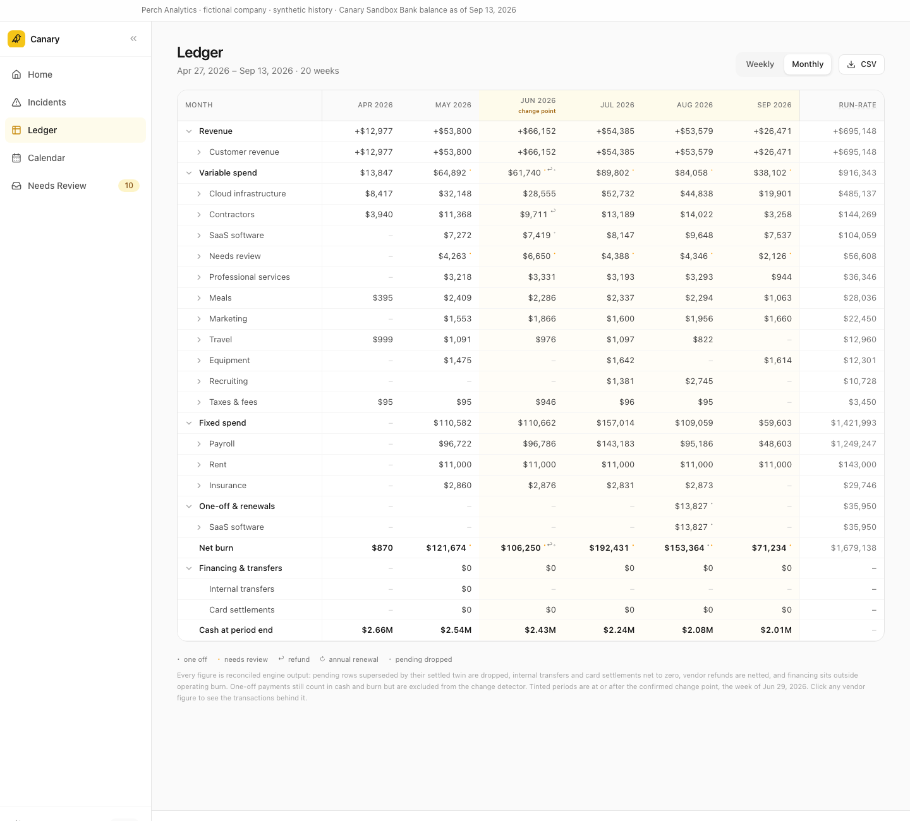 | 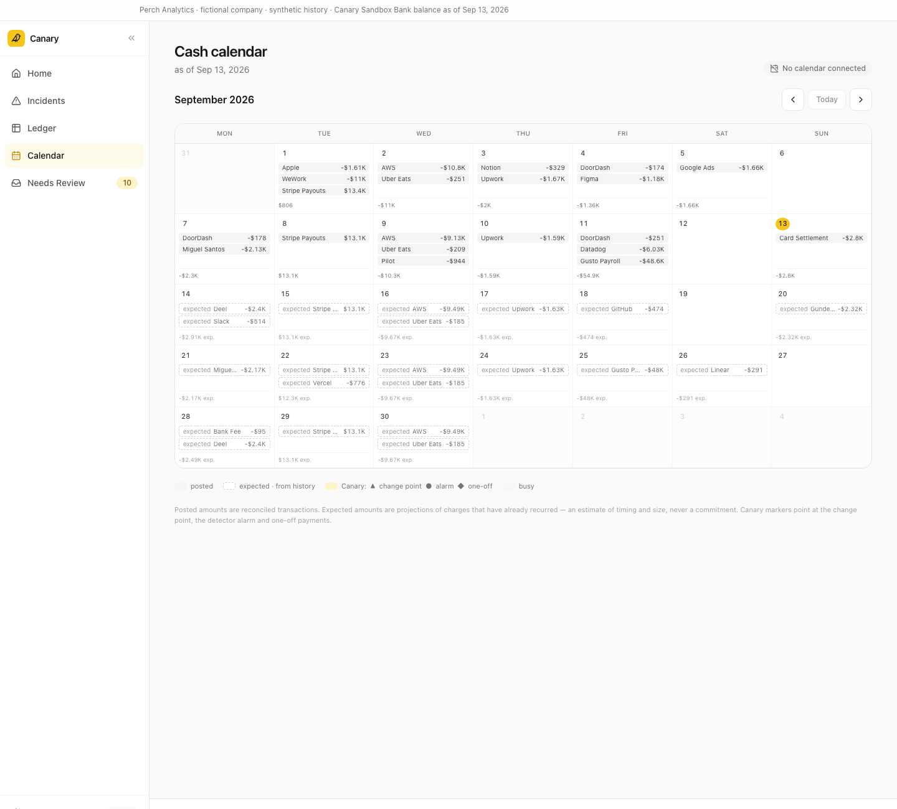 | 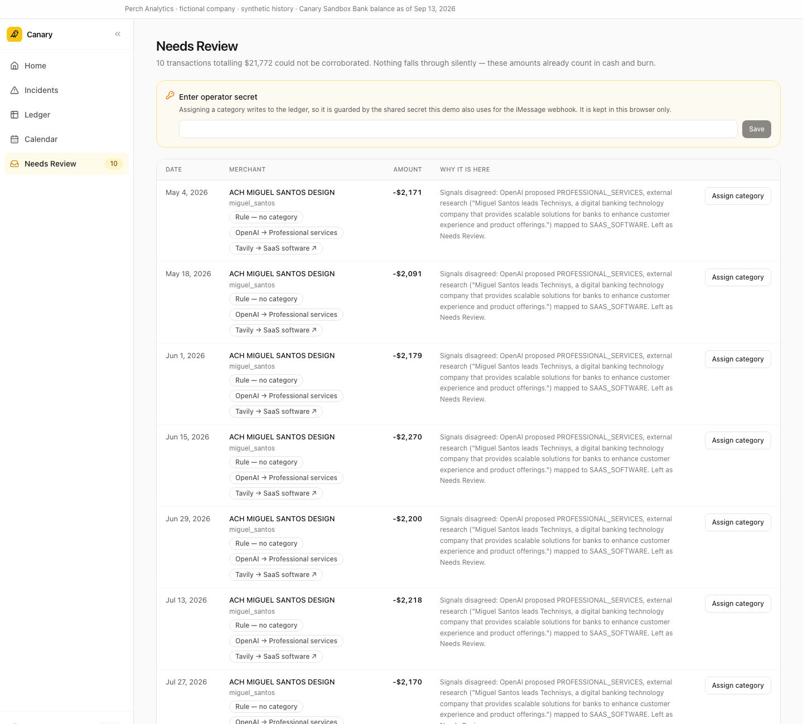 |

Every figure on these pages comes from `@canary/engine` view functions (`pivotLedger`, `pivotCell`, `projectRecurring`, `buildCashCalendarEvents`) served by the Worker. The pivot's weekly variable-spend row equals the CUSUM input series to the cent, asserted in tests.

---

## Demo flow

The memorable sequence from [`docs/DEMO.md`](docs/DEMO.md), about two minutes:

```text
Alert → WHY → SHOW ME → deep link → Incident → What-if
```

1. **Alert.** Show the phone: the text, then the native voice note directly below it. Both render from one incident object, so they can't disagree.
2. **`WHY`** → the change period, the pre/post weekly variable-spend rate, the largest contributors, and the rule that fired with its parameters and alarm week.
3. **`SHOW ME`** → a backend-generated deep link (`buildAppPath` + `PUBLIC_BASE_URL`; the model never writes a URL). Tap it.
4. **Incident page** → change point, contributor decomposition, current burn and runway, evidence. One incident, not three alerts for burn, cloud and infrastructure.
5. **Reconciliation** → point at the data-quality strip for ten seconds: transfers, settlements, financing and Needs Review handled before anything was detected.
6. **Tavily** → the unknown-vendor evidence line with its cited source. Corroborated only because OpenAI's proposal and Tavily's extraction agreed.
7. **What-if** → "what if the primary driver were 20% lower?" Monthly difference, runway effect, and the scenario-estimate label. The engine does this math, not the model.

Trigger the alert (operator only — sends text + voice note to `FOUNDER_PHONE`):

```bash
curl -X POST https://canary.bill-nguyentonhoang.workers.dev/api/alerts/send \
  -H "x-canary-secret: <WEBHOOK_SECRET>" \
  -H "content-type: application/json" \
  -d '{"force":true}'
```

`force` bypasses the notification policy for the demo; without it the route declines politely (`sent: false` plus the decision) when the incident isn't OPEN, isn't material, was already notified, or the founder is in a meeting. Body also accepts `to`, `incident_id`, and `voice: false`. Canary only replies to `FOUNDER_PHONE` / `ALLOWED_PHONES`; anything else is logged and ignored.

---

## Technical architecture

| Layer | What it is | Notes |
| --- | --- | --- |
| Edge runtime | One Cloudflare Worker | Serves `/api/*` and `/webhooks/*` itself; everything else falls back to the SPA's `index.html`, so `/incidents/:id` survives a hard refresh |
| HTTP | Hono | One route module per group, bodies typed from `packages/shared/src/api.ts` |
| Storage | Cloudflare D1 | `incidents`, `vendor_enrichments`, `classifications`, `classification_overrides`, `imessage_log`, `pending_alerts`, `job_state`. Migrations are additive only; CI applies them before the new Worker goes live |
| Scheduled work | Cron `*/5 * * * *` | Drains alerts the policy deferred while the founder was busy |
| Web | React 18 + Vite + Tailwind + shadcn/ui + Recharts | Builds into `apps/api/public`, served as Worker static assets |
| Data access | `DataProvider` interface | `PipelineDataProvider` over `@canary/pipeline` + `@canary/engine`; `withD1Overlay` layers persisted status, `last_notified` and enrichments on top of whichever provider is injected |
| Bank | `BankProvider` → `SandboxBankProvider` | The seam a real bank API would slot into without touching engine, detectors or UI |
| Determinism | `now` and `seed` injected everywhere | The Worker bundle stays free of `node:` imports — the Worker imports `@canary/classification/core`, not the package root |
| Testing | Vitest, offline | The Worker is tested with `app.request()` and injected fakes, no workerd; live provider tests skip themselves without keys |

---

## Run it

Node 22+, npm (not pnpm).

```bash
npm install
npm run typecheck        # all workspaces
npm test                 # all workspaces, offline, no secrets needed
npm run verify           # end-to-end pipeline assertions — must print ALL CHECKS PASSED
npm run build            # SPA → apps/api/public
```

Local development:

```bash
cp apps/api/.dev.vars.example apps/api/.dev.vars   # fill it in; never commit it
npm run migrate:local -w @canary/api               # once
npm run dev:api                                    # wrangler dev on :8787
npm run dev:web                                    # vite on :5173, proxies /api to :8787
VITE_USE_MOCK=1 npm run dev:web                    # SPA against fixtures, no Worker
```

Deploy: push to `main`. GitHub Actions runs test → build → D1 migrate → `wrangler deploy`. Manually: `npm run build && cd apps/api && npx wrangler deploy`.

### Secrets

Names only. They live in `apps/api/.dev.vars` (gitignored) and as Cloudflare Worker secrets — never in the repo, never in logs.

| Concern | Variables |
| --- | --- |
| iMessage (Sendblue) | `SENDBLUE_API_KEY`, `SENDBLUE_API_SECRET`, `SENDBLUE_FROM_NUMBER` |
| Category proposals (OpenAI) | `OPENAI_API_KEY` |
| Vendor corroboration (Tavily) | `TAVILY_API_KEY` |
| Voice notes (ElevenLabs) | `ELEVENLABS_API_KEY`, `ELEVENLABS_VOICE_ID` |
| Ask Canary (web voice) | `ELEVENLABS_API_KEY`, `ELEVENLABS_AGENT_ID` |
| Founder calendar (Google OAuth, one account) | `GOOGLE_CLIENT_ID`, `GOOGLE_CLIENT_SECRET`, `CALENDAR_TIMEZONE`, `FOUNDER_EMAIL`; iCal fallback `CALENDAR_ICS_URL`, `CALENDAR_SHOW_TITLES` |
| Conversational iMessage | `OPENAI_API_KEY` (shared with classification), optional `OPENAI_MODEL` |
| Operator / routing | `WEBHOOK_SECRET`, `FOUNDER_PHONE`, `ALLOWED_PHONES`, `PUBLIC_BASE_URL` |

`WEBHOOK_SECRET` is both the inbound Sendblue Global Secret (header `sb-signing-secret`) and the operator secret for privileged routes (header `x-canary-secret`).

### Calendar and conversation

- **Google Calendar (real OAuth, one founder account).** Connect once at `/oauth/google/start?secret=<WEBHOOK_SECRET>`; the refresh token is stored AES-GCM-encrypted in D1 and tokens are refreshed with plain `fetch`. Canary reads live free/busy from the primary calendar for the notification policy and the calendar page's busy blocks, and can **book a 15-minute review** in the next free business-hours slot (`POST /api/incidents/:id/schedule-review`, or reply `SCHEDULE` in iMessage). The OAuth app runs in Google's *Testing* mode (refresh tokens expire after 7 days — reconnect before a demo). Fallback when Google is not connected: one private iCal feed (`CALENDAR_ICS_URL`) read by a small RFC 5545 parser. With neither configured Canary has no availability signal and never defers an alert. Meeting titles are hidden unless `CALENDAR_SHOW_TITLES=1`.
- **Conversational iMessage.** Anything that isn't a keyword is answered by OpenAI tool-calling over Canary's deterministic tools (`get_health_summary`, `get_incident`, `simulate_cost_change`, `get_evidence`, `get_vendor_spend`, `create_app_link`), with per-phone memory in D1 and figure-free rolling compaction for long threads. Every money/percent/month figure in a generated reply must appear in that turn's tool results or the whole reply is replaced by the deterministic `WHY` text; URLs not from `create_app_link` are stripped; "pay / transfer / cancel" requests get a fixed refusal. Keywords (`WHY`, `SHOW ME`, `SOURCES`, `SCHEDULE`, `HELP`) still take the deterministic path first.

### Not built

- **No auth.** Fictional company, synthetic data, hackathon environment. Production would need workspace authorization, verified phone ownership and signed links.

---

## Project layout

```text
packages/
  shared/          types, config (every threshold), company profile, dates, money, API + tool contracts, fixtures
  generator/       deterministic 20-week synthetic ledger anchored to the sandbox bank balance
  engine/          reconciliation ledger, weekly buckets, burn/runway windows, what-if, ledger + calendar views
  detectors/       one-off rule, one-sided CUSUM, recurring-charge drift, decomposition, materiality, incidents
  classification/  merchant rules → OpenAI → Tavily corroboration → Needs Review, plus caches
  pipeline/        runPipeline() → DerivedDemoObject; verify.ts (contract §15); committed demo caches
apps/
  api/             Cloudflare Worker (Hono): REST, Sendblue webhook + alerts, voice, agent tools, D1, sandbox bank
    migrations/    additive-only D1 migrations
    public/        built SPA (generated)
  web/             Vite + React SPA — dashboard, incidents, ledger, calendar, needs review
docs/              PRD, build order, data + detector contract, agent behaviour, logic audit, demo, handoff
.github/workflows/ deploy.yml — PR: test · push to main: test → build → migrate → deploy
```

---

## Stack

| Layer | Choice |
| --- | --- |
| Backend | Cloudflare Workers + Hono + D1, one cron trigger |
| Web | React 18, Vite, Tailwind, shadcn/ui, Recharts, React Router |
| Language | TypeScript ESM everywhere, npm workspaces monorepo |
| Tests | Vitest — 888 tests, offline |
| Messaging | Sendblue (iMessage, inbound + outbound) |
| Voice | ElevenLabs → in-Worker CAF → native iMessage voice memo |
| Research | Tavily (corroboration, cited) · OpenAI (category proposals) |
| Statistics | One-sided CUSUM, robust MAD σ, vendor median/MAD one-off rule |

---

## Documents

| Doc | What it covers |
| --- | --- |
| [`AGENTS.md`](AGENTS.md) | The short version for anyone (human or agent) about to change code: non-negotiable rules, layout, commands, pre-PR checklist |
| [`docs/PRD.md`](docs/PRD.md) | Product requirements — thesis, target user, principles, every numbered spec section |
| [`docs/BUILD.md`](docs/BUILD.md) | Hackathon build order, Rule 0, the phase-by-phase checklist, definition of done |
| [`docs/DATA_AND_DETECTOR_CONTRACT.md`](docs/DATA_AND_DETECTOR_CONTRACT.md) | The contract between generator, engine, detectors and UI, including the §15 assertions `npm run verify` checks |
| [`docs/AGENT_BEHAVIOR.md`](docs/AGENT_BEHAVIOR.md) | The speech contract: when Canary may interrupt, the evidence taxonomy, where numbers may come from, what it must refuse, required answer shapes |
| [`docs/ALFREDO-LOGIC-AUDIT.md`](docs/ALFREDO-LOGIC-AUDIT.md) | Detector/engine audit — what was broken, the tests added, threshold rationale for every constant in `config.ts`, gaps left open on purpose |
| [`docs/DEMO.md`](docs/DEMO.md) | Two-minute demo script, fallback plan, judge Q&A cheat sheet |
| [`docs/HANDOFF.md`](docs/HANDOFF.md) | Current state — what exists, how it connects, how to operate it, known gaps |
| [`docs/WORKSTREAMS.md`](docs/WORKSTREAMS.md) | The original parallel-agent briefs, one per package |
| [`apps/api/README.md`](apps/api/README.md) | Worker internals — notification policy, calendar reader, `DataProvider` seam, module map |

---

## How it was built

Six agents in parallel, each in its own isolated git worktree on its own branch, each owning exactly one package or app. The coordination trick was freezing `@canary/shared` first — types, config, the API contract, the fixtures — so nobody had to wait on anybody: the engine could be written against the generator's output shape before the generator existed, and the SPA against the API contract before the Worker did. Branches were integrated in dependency order.

Then three independent read-only audits, each with a narrow brief: financial correctness, API and security, and the web app checked against real pipeline data. Their HIGH and MEDIUM findings were fixed. A separate detector and engine audit ([`docs/ALFREDO-LOGIC-AUDIT.md`](docs/ALFREDO-LOGIC-AUDIT.md)) recorded the rationale for every constant in `config.ts` and the gaps left open on purpose; the work that followed it added the recurring-charge drift detector, the messy-statement shapes in the `test` profile, and a what-if that explains why a scenario changed nothing.

The original briefs are in [`docs/WORKSTREAMS.md`](docs/WORKSTREAMS.md); the commit history on `main` tells the rest.

---

<div align="center">

**Reconcile first. Detect second. Research third. Explain everything.**

</div>
